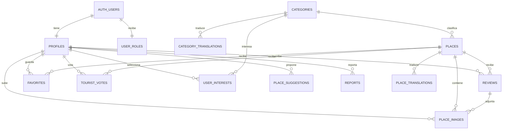

# MantaViews — Esquema de base de datos

## 1. Objetivo

Este documento define el modelo de datos del MVP de MantaViews sobre Supabase PostgreSQL. La ubicación actual del turista y las rutas calculadas se procesan temporalmente y **no se almacenan**.

## 2. Extensiones y convenciones

- PostgreSQL administrado por Supabase.
- `postgis` para coordenadas, distancias y búsquedas geográficas.
- `pgcrypto` para generar UUID.
- `pg_trgm` para búsquedas tolerantes a errores de escritura.
- Claves primarias UUID, excepto catálogos pequeños.
- Fechas en UTC usando `timestamptz`.
- Nombres SQL en `snake_case`.
- Borrado lógico mediante estados; no borrar contenido moderable físicamente.
- Las contraseñas y sesiones pertenecen a `auth.users`; nunca se guardan en tablas propias.

## 3. Diagrama entidad-relación



## 4. Tipos enumerados

```sql
create type public.app_role as enum ('user', 'admin');

create type public.content_status as enum (
  'pending',
  'published',
  'rejected',
  'archived'
);

create type public.report_target as enum (
  'place',
  'review',
  'image'
);

create type public.report_reason as enum (
  'incorrect_information',
  'duplicate',
  'inappropriate',
  'spam',
  'other'
);

create type public.report_status as enum (
  'open',
  'resolved',
  'dismissed'
);
```

## 5. Tablas

### 5.1 `profiles`

Información pública y preferencias básicas del usuario. Comparte el UUID con `auth.users`.

| Columna              | Tipo          | Reglas                           |
| -------------------- | ------------- | -------------------------------- |
| `id`                 | `uuid`        | PK, FK `auth.users(id)`, cascade |
| `display_name`       | `varchar(80)` | obligatorio                      |
| `avatar_path`        | `text`        | nullable; ruta en Storage        |
| `preferred_language` | `varchar(2)`  | `es` o `en`, default `es`        |
| `created_at`         | `timestamptz` | default `now()`                  |
| `updated_at`         | `timestamptz` | actualizado por trigger          |

### 5.2 `user_roles`

Rol protegido del usuario. No debe existir una política que permita al usuario editar su propio rol.

| Columna       | Tipo          | Reglas                           |
| ------------- | ------------- | -------------------------------- |
| `user_id`     | `uuid`        | PK, FK `auth.users(id)`, cascade |
| `role`        | `app_role`    | default `user`                   |
| `assigned_at` | `timestamptz` | default `now()`                  |
| `assigned_by` | `uuid`        | FK `auth.users(id)`, nullable    |

### 5.3 `categories`

Catálogo de categorías turísticas.

| Columna      | Tipo                                    | Reglas                  |
| ------------ | --------------------------------------- | ----------------------- |
| `id`         | `smallint generated always as identity` | PK                      |
| `slug`       | `varchar(50)`                           | unique; p. ej. `playas` |
| `icon`       | `varchar(50)`                           | nombre lógico del icono |
| `color`      | `varchar(7)`                            | formato hexadecimal     |
| `sort_order` | `smallint`                              | default `0`             |
| `is_active`  | `boolean`                               | default `true`          |

Valores iniciales: playas, restaurantes, hoteles, museos, vida nocturna, parques, monumentos, centros comerciales y actividades.

### 5.4 `category_translations`

| Columna       | Tipo          | Reglas                       |
| ------------- | ------------- | ---------------------------- |
| `category_id` | `smallint`    | FK `categories(id)`, cascade |
| `locale`      | `varchar(2)`  | `es` o `en`                  |
| `name`        | `varchar(80)` | obligatorio                  |

PK compuesta: (`category_id`, `locale`).

### 5.5 `places`

Datos independientes del idioma para cada lugar.

| Columna         | Tipo                    | Reglas                                  |
| --------------- | ----------------------- | --------------------------------------- |
| `id`            | `uuid`                  | PK, default `gen_random_uuid()`         |
| `category_id`   | `smallint`              | FK `categories(id)`                     |
| `created_by`    | `uuid`                  | FK `auth.users(id)`, nullable para seed |
| `status`        | `content_status`        | default `pending`                       |
| `location`      | `geography(Point,4326)` | obligatorio                             |
| `address`       | `varchar(250)`          | obligatorio                             |
| `phone`         | `varchar(30)`           | nullable                                |
| `website_url`   | `text`                  | nullable, validar HTTPS                 |
| `opening_hours` | `jsonb`                 | default `{}`                            |
| `price_level`   | `smallint`              | nullable, rango 0–4                     |
| `is_featured`   | `boolean`               | default `false`, solo admin             |
| `created_at`    | `timestamptz`           | default `now()`                         |
| `updated_at`    | `timestamptz`           | trigger                                 |
| `published_at`  | `timestamptz`           | nullable                                |

Ejemplo de `opening_hours`:

```json
{
  "monday": [{ "open": "08:00", "close": "18:00" }],
  "tuesday": [{ "open": "08:00", "close": "18:00" }],
  "timezone": "America/Guayaquil"
}
```

### 5.6 `place_translations`

| Columna             | Tipo           | Reglas                               |
| ------------------- | -------------- | ------------------------------------ |
| `place_id`          | `uuid`         | FK `places(id)`, cascade             |
| `locale`            | `varchar(2)`   | `es` o `en`                          |
| `name`              | `varchar(150)` | obligatorio                          |
| `short_description` | `varchar(280)` | obligatorio                          |
| `description`       | `text`         | obligatorio, máximo definido por API |

PK compuesta: (`place_id`, `locale`). Todo lugar publicado debe tener traducción `es`; `en` puede completarse antes de la presentación.

### 5.7 `reviews`

| Columna      | Tipo             | Reglas                                          |
| ------------ | ---------------- | ----------------------------------------------- |
| `id`         | `uuid`           | PK                                              |
| `place_id`   | `uuid`           | FK `places(id)`, cascade                        |
| `user_id`    | `uuid`           | FK `profiles(id)`, cascade                      |
| `rating`     | `smallint`       | entre 1 y 5                                     |
| `comment`    | `varchar(1000)`  | entre 3 y 1000 caracteres                       |
| `status`     | `content_status` | default `published`; puede moderarse/archivarse |
| `created_at` | `timestamptz`    | default `now()`                                 |
| `updated_at` | `timestamptz`    | trigger                                         |

Restricción unique: (`place_id`, `user_id`). El usuario edita su reseña existente en vez de crear varias.

### 5.8 `place_images`

| Columna        | Tipo             | Reglas                                      |
| -------------- | ---------------- | ------------------------------------------- |
| `id`           | `uuid`           | PK                                          |
| `place_id`     | `uuid`           | FK `places(id)`, cascade                    |
| `review_id`    | `uuid`           | FK `reviews(id)`, nullable                  |
| `uploader_id`  | `uuid`           | FK `profiles(id)`, nullable para seed admin |
| `storage_path` | `text`           | unique                                      |
| `alt_text`     | `varchar(180)`   | accesibilidad                               |
| `status`       | `content_status` | default `pending`                           |
| `is_cover`     | `boolean`        | default `false`, solo admin                 |
| `created_at`   | `timestamptz`    | default `now()`                             |

Solo puede existir una portada publicada por lugar.

### 5.9 `favorites`

| Columna      | Tipo          | Reglas                     |
| ------------ | ------------- | -------------------------- |
| `user_id`    | `uuid`        | FK `profiles(id)`, cascade |
| `place_id`   | `uuid`        | FK `places(id)`, cascade   |
| `created_at` | `timestamptz` | default `now()`            |

PK compuesta: (`user_id`, `place_id`).

### 5.10 `tourist_votes`

| Columna        | Tipo          | Reglas                     |
| -------------- | ------------- | -------------------------- |
| `user_id`      | `uuid`        | FK `profiles(id)`, cascade |
| `place_id`     | `uuid`        | FK `places(id)`, cascade   |
| `is_touristic` | `boolean`     | sí/no                      |
| `created_at`   | `timestamptz` | default `now()`            |
| `updated_at`   | `timestamptz` | trigger                    |

PK compuesta: (`user_id`, `place_id`). Los votos informan al administrador, pero no publican ni eliminan lugares automáticamente.

### 5.11 `user_interests`

| Columna       | Tipo       | Reglas                       |
| ------------- | ---------- | ---------------------------- |
| `user_id`     | `uuid`     | FK `profiles(id)`, cascade   |
| `category_id` | `smallint` | FK `categories(id)`, cascade |
| `weight`      | `smallint` | 1–5, default `1`             |

PK compuesta: (`user_id`, `category_id`).

### 5.12 `place_suggestions`

Lugar propuesto por un usuario para revisión administrativa.

| Columna        | Tipo                    | Reglas                        |
| -------------- | ----------------------- | ----------------------------- |
| `id`           | `uuid`                  | PK                            |
| `submitted_by` | `uuid`                  | FK `profiles(id)`             |
| `category_id`  | `smallint`              | FK `categories(id)`           |
| `location`     | `geography(Point,4326)` | ubicación propuesta           |
| `name`         | `varchar(150)`          | obligatorio                   |
| `description`  | `varchar(1500)`         | obligatorio                   |
| `address`      | `varchar(250)`          | obligatorio                   |
| `evidence_url` | `text`                  | nullable                      |
| `status`       | `content_status`        | default `pending`             |
| `reviewed_by`  | `uuid`                  | FK `auth.users(id)`, nullable |
| `review_notes` | `varchar(500)`          | nullable                      |
| `created_at`   | `timestamptz`           | default `now()`               |
| `reviewed_at`  | `timestamptz`           | nullable                      |

Al aprobar una sugerencia se crea un `place`; no se convierte la fila directamente.

### 5.13 `reports`

| Columna       | Tipo            | Reglas                          |
| ------------- | --------------- | ------------------------------- |
| `id`          | `uuid`          | PK                              |
| `reporter_id` | `uuid`          | FK `profiles(id)`               |
| `target_type` | `report_target` | lugar, reseña o imagen          |
| `target_id`   | `uuid`          | existencia validada por backend |
| `reason`      | `report_reason` | obligatorio                     |
| `details`     | `varchar(500)`  | nullable                        |
| `status`      | `report_status` | default `open`                  |
| `reviewed_by` | `uuid`          | FK `auth.users(id)`, nullable   |
| `created_at`  | `timestamptz`   | default `now()`                 |
| `resolved_at` | `timestamptz`   | nullable                        |

### 5.14 `admin_audit_logs`

Registro inmutable de acciones administrativas.

| Columna       | Tipo                                  | Reglas                 |
| ------------- | ------------------------------------- | ---------------------- |
| `id`          | `bigint generated always as identity` | PK                     |
| `admin_id`    | `uuid`                                | FK `auth.users(id)`    |
| `action`      | `varchar(80)`                         | p. ej. `place.publish` |
| `target_type` | `varchar(40)`                         | tipo de recurso        |
| `target_id`   | `uuid`                                | recurso afectado       |
| `before_data` | `jsonb`                               | nullable               |
| `after_data`  | `jsonb`                               | nullable               |
| `created_at`  | `timestamptz`                         | default `now()`        |

Solo puede leerse o insertarse desde lógica administrativa autorizada.

## 6. Vistas y funciones SQL

### `place_stats`

Vista `security_invoker` que calcula por lugar:

- `average_rating`
- `review_count`
- `touristic_yes_count`
- `touristic_no_count`
- `touristic_percentage`
- `favorite_count`

No se guardan estos valores duplicados en `places` durante el MVP.

### RPC requeridas

| Función               | Finalidad                                                   |
| --------------------- | ----------------------------------------------------------- |
| `search_places`       | Buscar por texto, categoría, idioma y paginación            |
| `nearby_places`       | Devolver lugares dentro de un radio ordenados por distancia |
| `get_place_detail`    | Obtener ficha traducida, estadísticas e imágenes            |
| `get_recommendations` | Calcular recomendaciones personalizadas                     |
| `is_admin`            | Verificar el rol sin exponer `user_roles`                   |

Las funciones públicas deben fijar explícitamente `search_path`, validar límites y respetar RLS.

## 7. Índices y restricciones

```sql
create index places_location_gix on public.places using gist (location);
create index places_status_category_idx on public.places (status, category_id);
create index reviews_place_status_idx on public.reviews (place_id, status);
create index place_images_place_status_idx on public.place_images (place_id, status);
create index suggestions_status_created_idx
  on public.place_suggestions (status, created_at desc);
create index reports_status_created_idx
  on public.reports (status, created_at desc);
create index place_translations_name_trgm_idx
  on public.place_translations using gin (name gin_trgm_ops);

create unique index one_published_cover_per_place
  on public.place_images (place_id)
  where is_cover = true and status = 'published';
```

También se requieren `check constraints` para idiomas, colores hexadecimales, URLs, puntuaciones, pesos y longitudes.

## 8. Matriz RLS resumida

| Recurso                       | Invitado                   | Usuario autenticado             | Administrador                |
| ----------------------------- | -------------------------- | ------------------------------- | ---------------------------- |
| Lugares/categorías publicados | Leer                       | Leer                            | CRUD y moderar               |
| Perfil                        | Leer nombre/avatar público | Leer públicos; editar el propio | Leer/moderar                 |
| Reseñas publicadas            | Leer                       | Leer; CRUD propia               | CRUD/moderar todas           |
| Favoritos                     | No                         | CRUD propios                    | Sin acceso ordinario         |
| Votos turísticos              | Leer agregados             | CRUD propio                     | Leer agregados/moderar lugar |
| Sugerencias                   | No                         | Crear y leer propias            | Leer/revisar todas           |
| Imágenes publicadas           | Leer                       | Leer/subir propias pendientes   | Publicar/rechazar            |
| Reportes                      | No                         | Crear y leer propios            | Leer/resolver                |
| Roles y auditoría             | No                         | No                              | Acceso restringido           |

Reglas críticas:

1. Activar RLS en cada tabla del esquema expuesto.
2. La aplicación usa únicamente la `publishable key` y el JWT del usuario.
3. La `service_role` solo puede existir como secreto de Edge Functions.
4. `user_roles` no acepta escrituras directas desde móvil o web.
5. Una cuenta administradora se crea mediante un script seguro o el Dashboard.

## 9. Storage

| Bucket         | Acceso                                                                       | Reglas                                      |
| -------------- | ---------------------------------------------------------------------------- | ------------------------------------------- |
| `avatars`      | Lectura pública                                                              | Usuario escribe solo en `user_id/*`         |
| `place-images` | Bucket privado; URL firmada solo para registros publicados o del propietario | Usuario escribe en `user_id/*`; máximo 5 MB |

Tipos admitidos: JPEG, PNG y WebP. El nombre físico debe ser UUID; no conservar nombres enviados por el usuario.

## 10. Datos que no se almacenan

- Ubicación actual del dispositivo.
- Historial de desplazamientos.
- Origen y destino de rutas consultadas.
- Respuestas completas de servicios cartográficos externos.
- Contraseñas o tokens OAuth.
