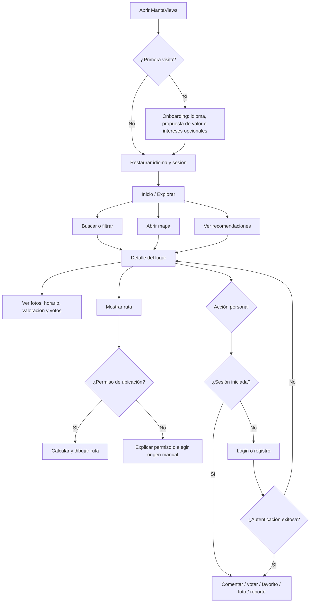
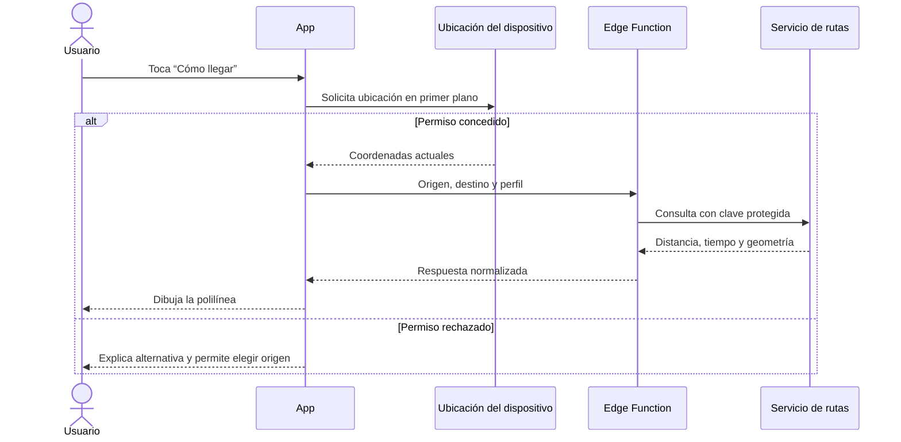
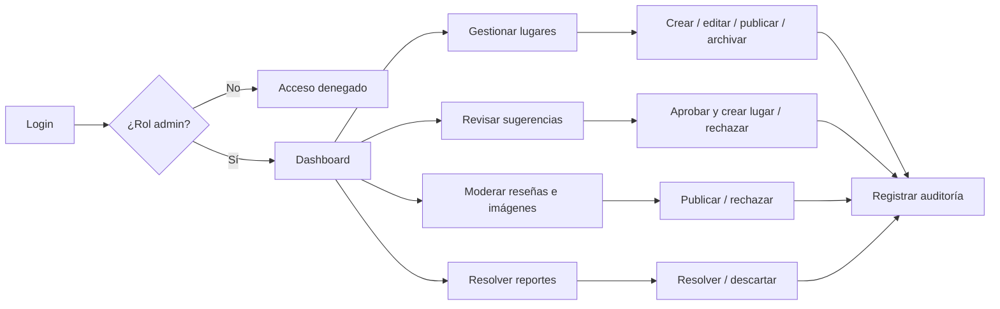

# MantaViews — Flujo de la aplicación

## 1. Principios del flujo

- Explorar Manta no requiere una cuenta.
- La autenticación aparece solo al realizar una acción personal: comentar, votar, guardar, subir una foto o sugerir un lugar.
- Después del login, el usuario regresa a la acción que intentó realizar.
- La ubicación es opcional; si se rechaza, se usa el centro de Manta como región inicial.
- La ubicación y las rutas no se almacenan.
- Todo estado remoto muestra carga, vacío, error y opción de reintentar.
- La navegación principal usa cuatro pestañas: **Explorar**, **Mapa**, **Favoritos** y **Perfil**.

## 2. Flujo general del turista



## 3. Inicio y onboarding

### Primera apertura

1. Mostrar splash breve con marca MantaViews.
2. Elegir idioma: español o inglés; sugerir el idioma del dispositivo.
3. Explicar en máximo tres pantallas:
   - descubrir lugares turísticos;
   - consultar mapa y rutas;
   - participar con reseñas y votos.
4. Permitir seleccionar categorías de interés; es opcional.
5. No pedir ubicación todavía. Se solicita cuando el usuario abre el mapa o busca lugares cercanos.
6. Entrar como invitado a Explorar.

### Aperturas posteriores

1. Restaurar idioma.
2. Restaurar sesión Supabase si existe.
3. Cargar categorías, lugares destacados y recomendaciones.
4. Mostrar contenido cacheado durante la recarga cuando sea posible.

## 4. Navegación propuesta con Expo Router

```text
src/app/
├── _layout.tsx
├── index.tsx                       # redirección a /(tabs)
├── onboarding.tsx
├── (tabs)/
│   ├── _layout.tsx
│   ├── index.tsx                   # Explorar
│   ├── map.tsx                     # Mapa
│   ├── favorites.tsx               # Favoritos
│   └── profile.tsx                 # Perfil
├── place/
│   └── [id].tsx                    # Detalle
├── search.tsx
├── directions.tsx                 # Vista previa de ruta
├── (auth)/
│   ├── _layout.tsx
│   ├── sign-in.tsx
│   ├── sign-up.tsx
│   ├── forgot-password.tsx
│   └── auth-callback.tsx
├── review/
│   └── [place-id].tsx
├── suggest-place.tsx
├── report.tsx
└── (admin)/
    ├── _layout.tsx
    ├── index.tsx                   # resumen
    ├── places/
    │   ├── index.tsx
    │   └── [id].tsx
    ├── suggestions.tsx
    ├── moderation.tsx
    └── reports.tsx
```

Los archivos de `src/app` solo definen rutas. La UI compleja vive en `src/screens`, los componentes reutilizables en `src/components` y el acceso a Supabase/servicios en `src/services`.

## 5. Pestaña Explorar

1. Header con logo compacto, saludo contextual y selector de idioma.
2. Campo de búsqueda.
3. Carrusel horizontal de categorías.
4. Sección “Recomendados para ti”.
5. Sección “Lugares destacados”.
6. Sección “Cerca de ti” solo si existe permiso.
7. Tocar una tarjeta abre `/place/[id]`.
8. Pull-to-refresh vuelve a consultar los datos.

Estados:

- Cargando: skeletons, no pantalla vacía.
- Sin resultados: mensaje y botón para limpiar filtros.
- Sin internet: mensaje, reintento y últimos datos cacheados si existen.
- Error del servidor: mensaje comprensible y acción de reintento.

## 6. Búsqueda y filtros

1. El usuario escribe un nombre o palabra clave.
2. Se espera brevemente antes de consultar para evitar una petición por tecla.
3. Puede filtrar por categoría, distancia y valoración.
4. Los filtros activos se muestran como chips removibles.
5. Los resultados pueden verse como lista o abrirse en el mapa.
6. Si no hay coincidencias, ofrecer categorías populares y limpiar filtros.

## 7. Pestaña Mapa

1. Mostrar Manta como región inicial.
2. Solicitar permiso de ubicación solo al usar “Mi ubicación”.
3. Cargar marcadores únicamente para la región visible o dentro de un radio.
4. Agrupar marcadores si hay demasiados.
5. Al tocar un marcador, mostrar tarjeta resumida inferior.
6. Al tocar la tarjeta, abrir el detalle.
7. Mantener filtros sincronizados con Explorar.

Si se rechaza el permiso, el mapa sigue siendo completamente navegable y explica cómo habilitarlo desde ajustes.

## 8. Detalle del lugar

Orden recomendado:

1. Galería y portada.
2. Nombre, categoría, valoración y porcentaje turístico.
3. Botones: **Cómo llegar**, **Guardar**, **Compartir**.
4. Descripción traducida.
5. Dirección, horario, teléfono y sitio web.
6. Mapa pequeño con marcador.
7. Votación “¿Consideras que este lugar es turístico?”.
8. Reseñas y fotografías de usuarios.
9. Acciones: escribir reseña, subir foto y reportar información.

Las acciones personales pasan por el guard de autenticación.

## 9. Ruta



La pantalla permite cambiar entre caminar y conducir si el proveedor lo admite, y ofrece abrir Google Maps/Waze. No proporciona navegación giro a giro.

## 10. Autenticación contextual

Acciones que exigen sesión:

- Guardar favorito.
- Escribir o editar reseña.
- Votar.
- Subir foto.
- Sugerir lugar.
- Reportar contenido.
- Editar perfil e intereses.

Flujo:

1. Guardar la ruta y acción intentada en memoria.
2. Mostrar login como pantalla/modal.
3. Permitir correo/contraseña, registro y Google.
4. Tras autenticar, regresar al detalle y reanudar la acción.
5. Si cancela, regresar sin modificar datos.

El registro solicita: nombre visible, correo, contraseña y aceptación de privacidad. No se debe solicitar ubicación, teléfono ni otros datos innecesarios.

## 11. Reseñas, votos y fotografías

### Reseña

1. Seleccionar 1–5 estrellas.
2. Escribir entre 3 y 1000 caracteres.
3. Enviar y actualizar la caché del lugar.
4. Si ya existe una reseña propia, abrirla en modo edición.
5. Mostrar resultado o error sin duplicar envíos.

### Voto turístico

1. Elegir sí/no.
2. Crear o actualizar el voto único.
3. Refrescar el porcentaje agregado.
4. Informar que la votación no elimina automáticamente el lugar.

### Fotografía

1. Elegir desde galería o cámara.
2. Comprimir antes de subir.
3. Validar formato y tamaño.
4. Solicitar texto alternativo breve.
5. Subir como pendiente.
6. Informar que aparecerá después de moderación.

## 12. Favoritos y perfil

### Favoritos

- Sin sesión: mostrar beneficio y botón de login.
- Con sesión: lista sincronizada de lugares guardados.
- Permitir quitar favorito con confirmación reversible visualmente.

### Perfil

- Invitado: botones de iniciar sesión y registrarse.
- Autenticado: nombre, avatar, idioma, intereses, sugerencias enviadas y cerrar sesión.
- Administrador: enlace adicional al panel administrativo.

## 13. Sugerir un lugar

1. Requiere sesión.
2. Seleccionar punto en el mapa.
3. Ingresar nombre, categoría, dirección y descripción.
4. Añadir evidencia opcional.
5. Confirmar que la información será revisada.
6. Mostrar estado: pendiente, publicado o rechazado.

## 14. Flujo administrativo



El frontend nunca considera suficiente ocultar botones: cada operación se vuelve a autorizar con JWT, RLS y verificación de rol en backend.

## 15. Idioma

- La interfaz usa claves de traducción, no textos dispersos.
- Los lugares consultan primero el idioma seleccionado.
- Si falta inglés, se usa español como fallback y se indica internamente para completar el contenido.
- Cambiar idioma invalida las consultas cuyo contenido depende de `locale`.

## 16. Cierre de sesión y privacidad

1. Confirmar cierre de sesión.
2. Revocar la sesión Supabase.
3. Limpiar datos privados de la caché.
4. Conservar únicamente idioma y preferencias no sensibles.
5. Regresar a Explorar como invitado.
